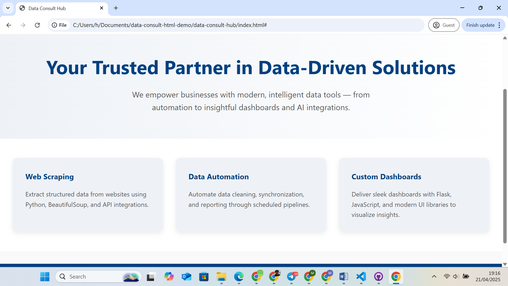

# Data Consult Hub – HTML Landing Page

This is a responsive, modern HTML landing page designed for a fictional data consulting company. It demonstrates my front-end skills using clean HTML and CSS, with a layout that works on desktop and mobile devices.

## 💡 Features
- Mobile-responsive layout
- Clean and modern design
- Written with semantic HTML5 and custom CSS
- Sections: Hero, Features, Contact footer

## 📸 Preview

## 🛠️ Built With
- HTML5
- CSS3 (Flexbox)

## 📁 How to Run
1. Clone this repo or [Download ZIP](#)
2. Open `index.html` in your browser

## 📄 License
This project is licensed under the MIT License.
